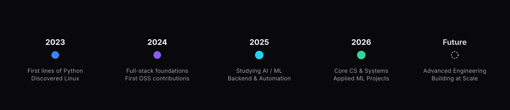

<div align="center">



<br/>

<a href="https://github.com/PrinceAryann?tab=repositories"></a>
<a href="https://www.linkedin.com/in/mraryan/"></a>
<a href="#-connect-with-me"></a>
<a href="mailto:rabbitpet566@gmail.com"></a>

</div>


<br/>

## 🪞 Introduction

<table>
<tr>
<td width="140" align="center" valign="top">

</td>
<td valign="top">

**Prince Aryan (Prince Kumar Kuswaha)**  
📍 India &nbsp;·&nbsp; 🎓 Integrated MSc. Computer Science &nbsp;·&nbsp; 🏛️ Assam University, Silchar  

I build software at the intersection of **full-stack engineering, systems, and clean interface design** — focused on building tools that are efficient under the hood and quiet on the surface. Currently **studying AI / ML**, exploring machine learning algorithms and practical applications while maintaining an Arch Linux environment tuned past the point of reason. Simultaneously preparing for **AFCAT / CDS**, cultivating discipline both in code and in life.

</td>
</tr>
</table>


<br/>

## 🎯 Current Focus

<table>
<tr>
<td align="center" width="20%">
<br/><b>Studying AI / ML</b><br/><sub>Algorithms &amp; Foundations</sub>
</td>
<td align="center" width="20%">
<br/><b>Full Stack</b><br/><sub>FastAPI, React &amp; Modern Web</sub>
</td>
<td align="center" width="20%">
<br/><b>Linux &amp; Systems</b><br/><sub>Arch, Neovim &amp; Scripting</sub>
</td>
<td align="center" width="20%">
<br/><b>Open Source</b><br/><sub>Building tools &amp; contributing</sub>
</td>
<td align="center" width="20%">
<br/><b>AFCAT / CDS</b><br/><sub>Defence competitive prep</sub>
</td>
</tr>
</table>


<br/>

## 🧩 Tech Stack

<details open>
<summary><b>Languages</b></summary>
<br/>

</details>

<details open>
<summary><b>AI / ML (Currently Studying)</b></summary>
<br/>

</details>

<details open>
<summary><b>Backend &amp; APIs</b></summary>
<br/>

</details>

<details open>
<summary><b>Frontend</b></summary>
<br/>

</details>

<details open>
<summary><b>Databases</b></summary>
<br/>

</details>

<details open>
<summary><b>DevOps, Cloud &amp; Automation</b></summary>
<br/>

</details>

<details open>
<summary><b>Tools &amp; Workflow</b></summary>
<br/>

</details>


<br/>

## 🚀 Featured Projects

<table>
<tr>
<td width="50%" valign="top">

### 🌐 [AUS_NKN_Connect](https://github.com/PrinceAryann/AUS_NKN_Connect)
`Maintained` · `Automation`

Python automation engine utilizing **Selenium** to automatically authenticate and log in to Assam University's NKN Wi-Fi captive portal, eliminating manual sign-in friction.

**Stack:** `Python` `Selenium` `WebAutomation`  
**Highlights:** Headless browser simulation · Auto-reconnect daemon · Zero credential friction  

<a href="https://github.com/PrinceAryann/AUS_NKN_Connect"></a>

</td>
<td width="50%" valign="top">

### 🔐 [Password Manager](https://github.com/PrinceAryann/Password_Manager)
`Complete` · `Security`

Local-first, zero-knowledge credential vault featuring symmetric cryptographic encryption, master password hashing, and strong password generation.

**Stack:** `Python` `Cryptography` `Tkinter`  
**Highlights:** Symmetric cipher encryption · Master auth validation · Secure local database  

<a href="https://github.com/PrinceAryann/Password_Manager"></a>

</td>
</tr>

<tr>
<td width="50%" valign="top">

### 🕷️ [Hacker News &amp; Price Scraper](https://github.com/PrinceAryann/Scrapping)
`Complete` · `Automation`

Automated scraping pipeline extracting top stories with popularity rankings and tracking product prices with threshold alerting via SMTP.

**Stack:** `Python` `BeautifulSoup` `Requests` `SMTP`  
**Highlights:** CSV data pipeline · Upvote sorting algorithms · Automated email drop alerts  

<a href="https://github.com/PrinceAryann/Scrapping"></a>

</td>
<td width="50%" valign="top">

### 🎵 [Music-Voice-Separation](https://github.com/PrinceAryann/Music-Voice-Separation)
`Complete` · `Audio Processing`

Audio source separation pipeline powered by **Demucs** to separate vocal tracks and background instrumentals from multi-channel audio tracks.

**Stack:** `Python` `PyTorch` `Demucs` `AudioProcessing`  
**Highlights:** Multi-stem separation · Torch GPU acceleration · High-fidelity audio extraction  

<a href="https://github.com/PrinceAryann/Music-Voice-Separation"></a>

</td>
</tr>

<tr>
<td width="50%" valign="top">

### 📊 [CCE Student Tech &amp; AI Survey](https://github.com/PrinceAryann/-CCE-Student-Technology-AI-Perception-Survey)
`Complete` · `Research`

Community Engagement Project platform surveying Grade 5–10 students to analyze technology interaction patterns, AI assistant familiarity, and modern digital learning readiness.

**Stack:** `Python` `Web Tool` `Data Analysis`  
**Highlights:** Interactive survey portal · Demographic perception breakdown · Insight visualization  

<a href="https://github.com/PrinceAryann/-CCE-Student-Technology-AI-Perception-Survey"></a>

</td>
<td width="50%" valign="top">

### ☕ [Coffee Machine Simulator](https://github.com/PrinceAryann/Coffee_Machine)
`Complete` · `Simulation`

Object-oriented simulation of a commercial coffee vending machine with coin evaluation, dynamic ingredient resource tracking, transaction debit/credit, and administrative reporting.

**Stack:** `Python` `OOP` `CLI`  
**Highlights:** Modular state management · Resource depletion alerts · Financial reporting  

<a href="https://github.com/PrinceAryann/Coffee_Machine"></a>

</td>
</tr>
</table>

<details>
<summary><b>🎮 Fundamentals Archive — Pong · Snake · Quiz Game</b></summary>
<br/>

Interactive programs and foundational software built during core computer science exploration:

| Project | Description | Stack | Link |
|---|---|---|---|
| **Pong Game** | Two-player paddle table tennis simulation with real-time collision detection | `Python` `Turtle` | [View Repo](https://github.com/PrinceAryann/Pong_Game) |
| **Quiz Engine** | Interactive CLI testing system evaluating programming concepts & general knowledge | `Python` | [View Repo](https://github.com/PrinceAryann/Quiz) |
| **Snake Game** | Grid-based arcade classic with dynamic speed scaling and high-score persistence | `Python` `Pygame` | `Archive` |

</details>


<br/>

## 📊 GitHub Analytics

<div align="center">


<br/><br/>


</div>


<br/>

## 🧭 Development Journey — 2023 → 2026 → Future




<br/>

## 🖥️ Linux Setup

```
                 .o+`                   -------------- 
                 `ooo/                   OS: Arch Linux x86_64 
                `+oooo:                  Host: ASUS TUF Gaming A15 FA507NVR_FA507NVR 1.0 
               `+oooooo:                 Kernel: 7.2.7-arch1-1 
               -+oooooo+:                Uptime: 1 hour, 27 mins 
             `/:-:++oooo+:               Packages: 1137 (pacman) 
            `/++++/+++++++:              Shell: bash 5.3.20 
           `/++++++++++++++:             Resolution: 1920x1080 
          `/+++ooooooooooooo/`           DE: Plasma 6.7.5 
         ./ooosssso++osssssso+`          WM: kwin 
        .oossssso-````/ossssss+`         Theme: Breeze-Dark [GTK2], Breeze [GTK3] 
       -osssssso.      :ssssssso.        Icons: WhiteSur-dark [GTK2/3] 
      :osssssss/        osssso+++.       Terminal: konsole 
     /ossssssss/        +ssssooo/-       CPU: AMD Ryzen 7 7435HS (16) @ 4.553GHz 
   `/ossssso+/:-        -:/+osssso+-     GPU: NVIDIA GeForce RTX 4060 Max-Q / Mobile 
  `+sso+:-`                 `.-/+oso:    Memory: 6838MiB / 15800MiB 
 `++:.                           `-/+/
 .`                                 `/

```


<br/>

## 🌱 Development Philosophy

> *"Simplicity is the ultimate sophistication — build the thing that disappears into the experience, not the one that announces itself."*


<br/>

## 🎧 Setup &amp; Workflow

<div align="center">

**Editor:** Neovim + custom keymaps &nbsp;·&nbsp; **Terminal:** Kitty + Starship prompt &nbsp;·&nbsp; **Shell:** Zsh &nbsp;·&nbsp; **VCS:** Git

</div>


<br/>

## 🔗 Connect With Me

<div align="center">

<a href="https://www.linkedin.com/in/mraryan/"></a>&nbsp;
<a href="https://github.com/PrinceAryann"></a>&nbsp;
<a href="https://www.instagram.com/_prince_aryannn_/"></a>&nbsp;
<a href="mailto:rabbitpet566@gmail.com"></a>&nbsp;

</div>

<br/>


</div>
